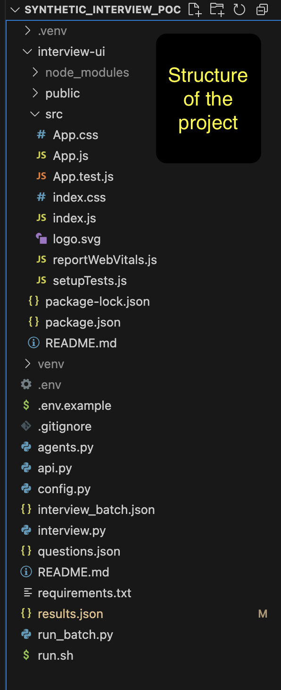
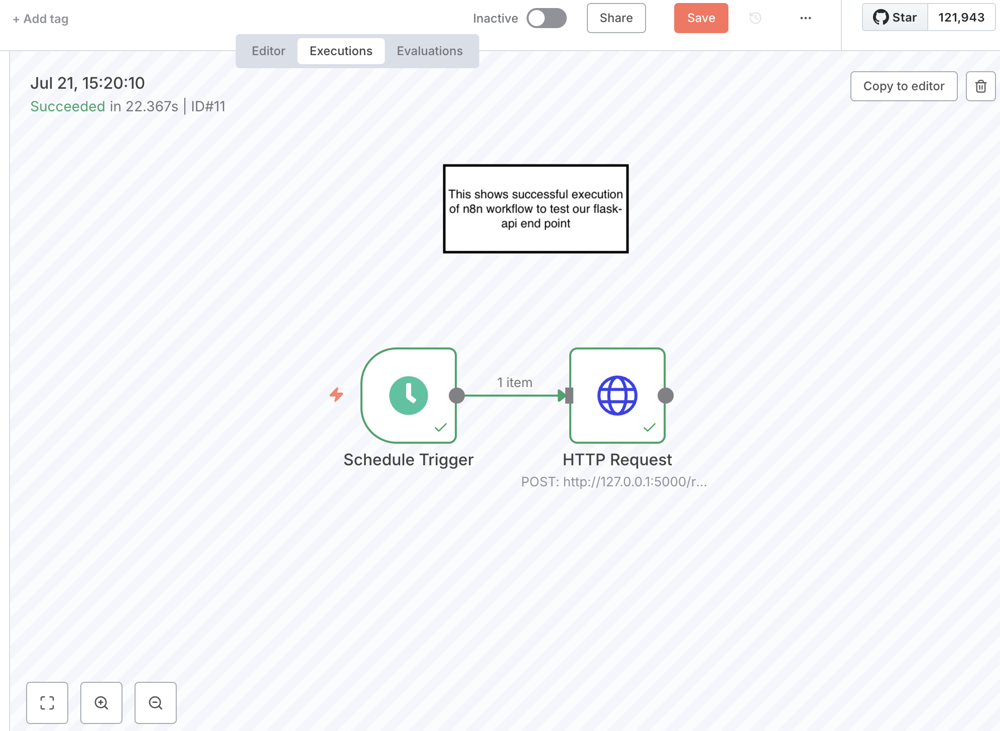
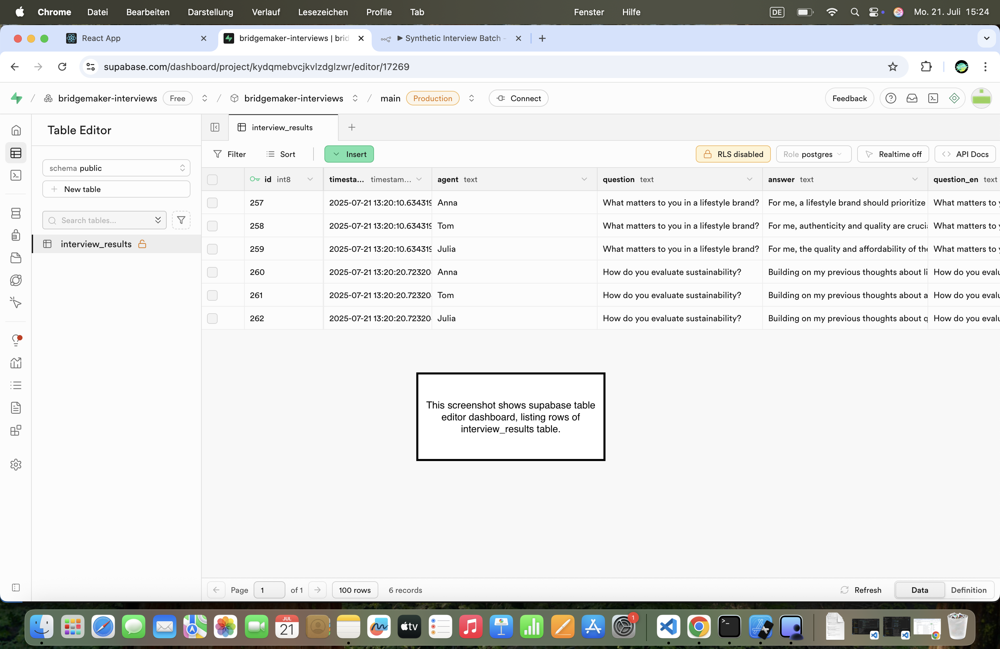
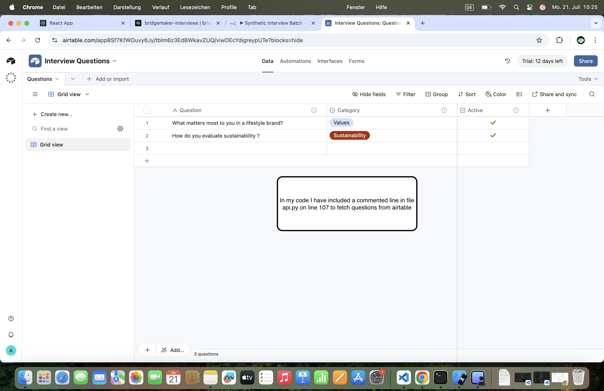
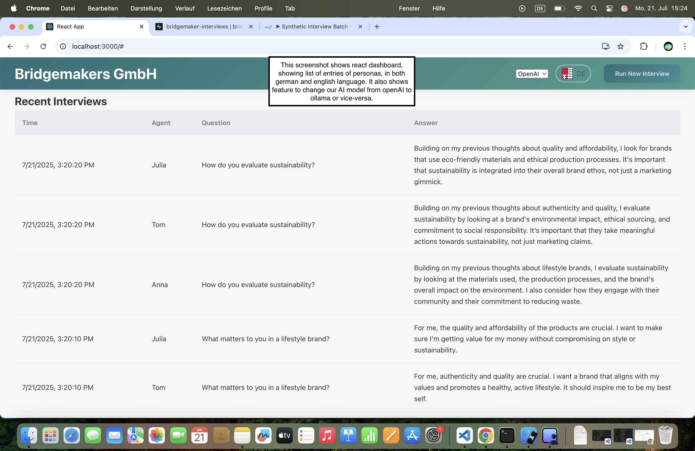
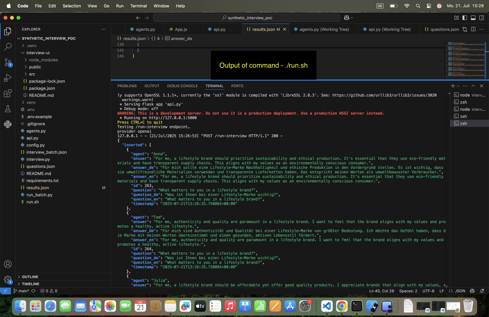

````markdown
# Synthetic Interview PoC

**Automatisierte synthetische Interviews für eine Lifestyle‑Marke**

---

## 🚀 Projektübersicht

Dies ist ein Mini‑Proof‑of‑Concept, das synthetische Interviews mit mehreren KI‑Personas durchführt, die Ergebnisse speichert und sowohl über eine CLI als auch eine REST‑API bereitstellt. Zusätzlich gibt es ein cron‑geeignetes Batch‑Skript zur Automatisierung.

---

## 🔧 Voraussetzungen

- **Python ≥ 3.8**  
- **Node.js & npm** (nur für das React‑Frontend)  
- **OpenAI API Key** (oder lokales LLM via Ollama)  
- **Supabase** und **Airtable** Zugangsdaten (optional)  

Erstellen Sie eine `.env`-Datei basierend auf [.env.example](.env.example).

---

## 📦 Installation

1. Repo klonen  
   ```bash
   git clone https://github.com/anirudhflutter/synthetic_interview_poc.git
   cd synthetic_interview_poc
````

2. Python‑Abhängigkeiten installieren

   ```bash
   pip install -r requirements.txt
   ```

3. (Optional) Frontend installieren

   ```bash
   cd interview-ui
   npm install
   cd ..
   ```

---

## ⚙️ Konfiguration (.env)

Kopieren Sie `.env.example` → `.env` und tragen Sie Ihre Werte ein:

```dotenv
OPENAI_API_KEY=
SUPABASE_URL=
SUPABASE_KEY=
AIRTABLE_TOKEN=
AIRTABLE_BASE_ID=
AIRTABLE_TABLE_NAME=
```

---

## 💻 Nutzung

### 1. CLI Interview Runner

```bash
python3 interview.py --questions questions.json
```

Führt ein Interview mit den Fragen aus `questions.json` durch und speichert die Antworten in `results.json`.

---

### 2. Flask REST API

```bash
export FLASK_APP=api.py
flask run
```

Anfrage:

```bash
curl -X POST http://localhost:5000/run-interview \
     -H "Content-Type: application/json" \
     --data @questions.json
```

Gibt eine JSON-Antwort mit den Antworten aller Personas zurück.

---

### 3. Batch‑Automatisierung

```bash
./run.sh
```

Das Skript liest `interview_batch.json`, führt Interviews über `run_batch.py` aus, speichert in `results.json` und simuliert einen Webhook‑Call per Logausgabe.

---

## 📂 Projektstruktur

```
.
├── interview.py           # CLI runner
├── api.py                 # Flask API
├── run_batch.py           # Batch‑Script
├── run.sh                 # Shell wrapper für Batch
├── questions.json         # CLI‑Fragen
├── interview_batch.json   # Batch‑Konfiguration
├── results.json           # Letzte Ergebnisse
├── .env.example           # Env‑Var Vorlage
├── requirements.txt       # Python‑Dependencies
└── interview-ui/          # React‑Frontend
```

---

## 🤝 Mitwirken

1. Feature‑Branch erstellen:

   ```bash
   git checkout -b feat/your-feature
   ```
2. Änderungen commiten:

   ```bash
   git commit -m "feat: Beschreibung"
   ```
3. Push & PR öffnen:

   ```bash
   git push -u origin feat/your-feature
   ```

---

## 🔮 Future Improvements & Known Limitations

* **Deepen Problem Understanding**: Having a meeting with stakeholders regarding end goal of the project and focusing on user research to ensure questions map to business goals.
* **Client‑side Caching**: Focusing on reducing redundant API calls via caching the results. Reduce redundant API calls by caching recent interview results.
* **Error Handling**: To handle transient failures, implementing retry logics.
* **Localization**: Focusing on how to extend language support to add any new language easily in future, specially once platform is scaling.
* **Authentication**: Working on security so only authorized clients can trigger our API calls. 
* **Webhooks**: Will focus on replacing log-based simulation with webhook callbacks.

## 📸 Screenshots






